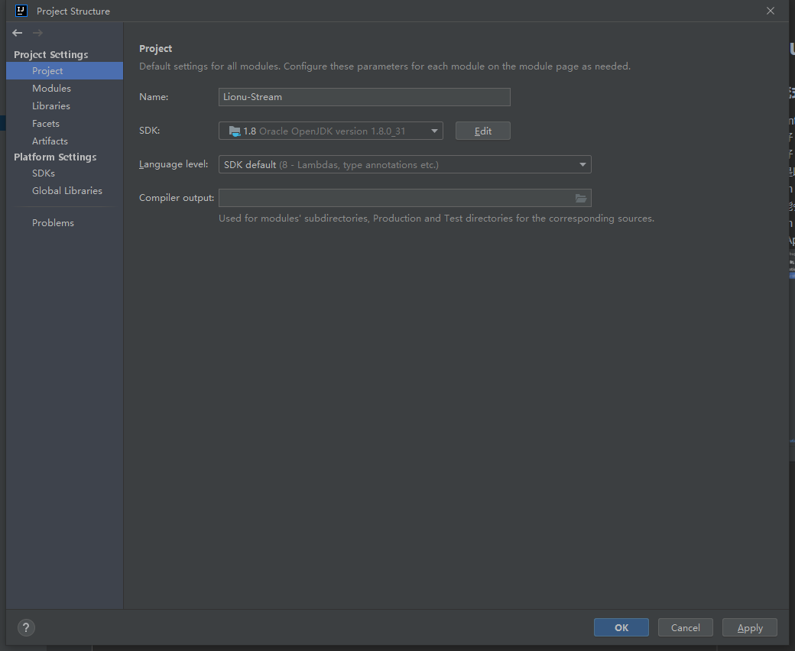
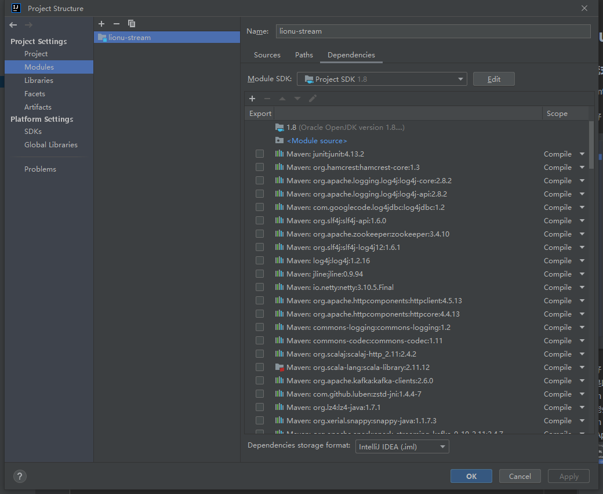
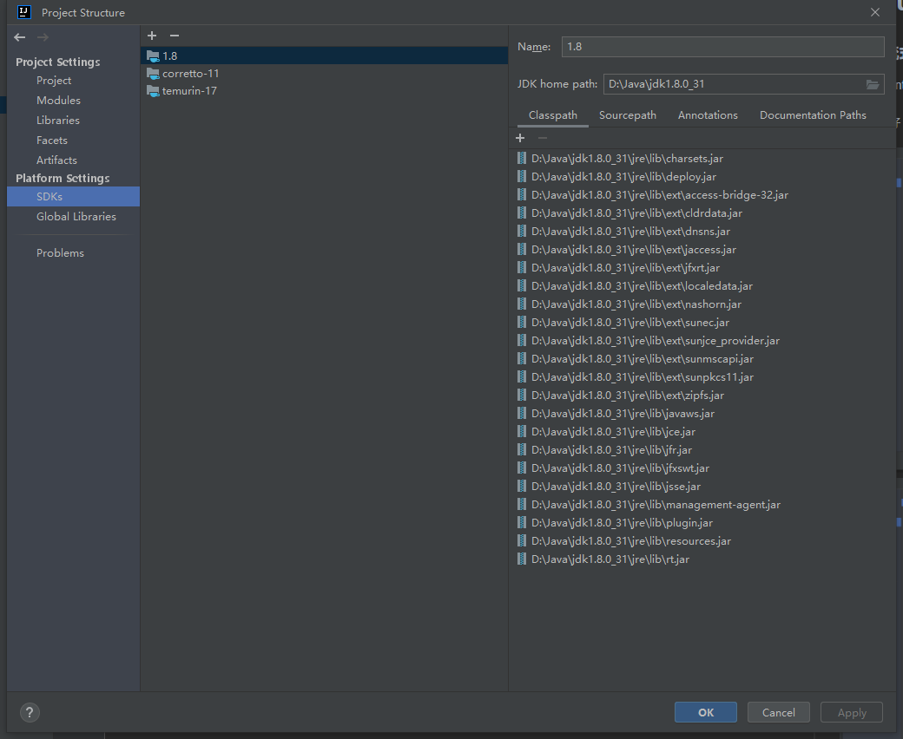
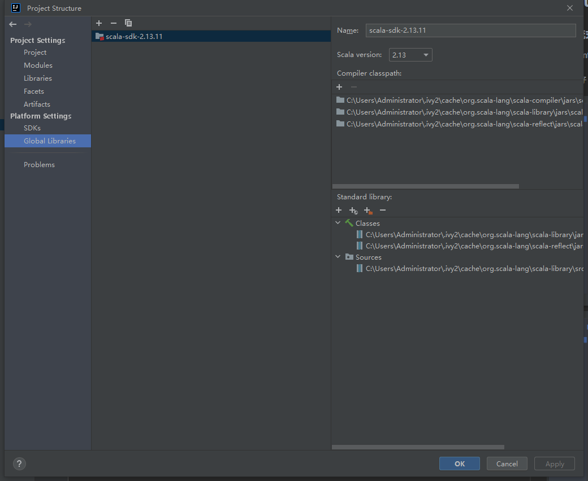
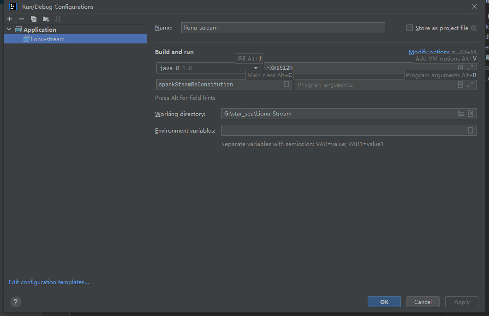

# Lionu-Stream 
### Spark流式处理数据代码构建需知
- 使用 IntelliJ IDEA Community Edition 2022.3.3 打开 clone 下来的代码
- 配置好 JDK1.8 和 Scala SDK 2.13.11，下面配置示例可供参考





- 定位好 IDEA 的 Maven 目录，即 .m2 的路径<br>
因为是以新项目方式打开 Lionu-Stream 的源码<br>
Maven 的路径会默认定位在 C 盘<br>
这可能会与您的原本位置不一样，所以需要手动再重新定位一下<br>
Maven 的配置在 File -> Settings -> Maven 处修改

- 新建 Application 的 Run Configurations , 配置如下图所示
    
- 修改项目的 application.properties 配置<br>
   src / main / resources / application.properties
```
#kafka相关配置
kafkaParams.bootstrap.servers=x.x.x.x:9092
kafkaParams.key.deserializer=classOf[StringDeserializer]
kafkaParams.value.deserializer=classOf[StringDeserializer]
kafkaParams.group.id=
#redis配置
redis.server=x.x.x.x
redis.port=6379
#mysql配置
mysql.url=jdbc:mysql://x.x.x.x:3306/lionu
mysql.user=root
mysql.password=xxx
```
这里填上相关服务的配置，注意：这些服务需要在服务器上打开远程访问配置

- 让项目 Run 起来~

#### Tips 请尽量按照上述参数配置项目，因为不同 sdk 版本可能会有兼容性问题而让项目 Run 不起来


